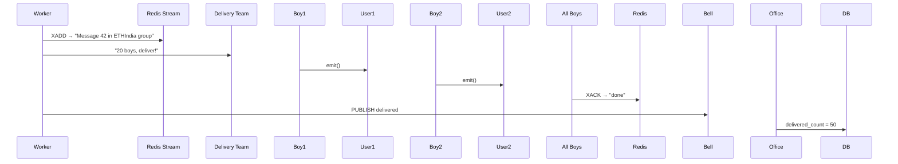

# Multi-Tenant Notification Engine: Overview

## What it is

A real-time notification system that sends notifications to users across multiple tenants (hackathons). It supports:
- Multi-tenancy: separate data and queues per tenant
- Real-time delivery via WebSockets (Socket.io)
- Horizontal scaling with workers
- Reliability: retries, backpressure, and delivery tracking

## Architecture and flow

### Components

1. Main API Server (`index.js`)
   - Receives notification requests
   - Manages WebSocket connections
   - Queues jobs for processing

2. Worker Process (`worker.js`)
   - Processes jobs from queues
   - Delivers notifications via Socket.io
   - Handles fan-out to multiple users

3. Frontend (`App.js`)
   - React UI that connects to the server
   - Receives real-time notifications
   - Can trigger test notifications

### Data flow

```
1. API Request → POST /notify/:hackathonId
   ↓
2. Save to PostgreSQL (persistence)
   ↓
3. Add job to BullMQ queue (tenant-specific queue)
   ↓
4. Worker picks up job from queue
   ↓
5. Worker queries database for users in that tenant
   ↓
6. Worker fans-out notification via Socket.io to all users
   ↓
7. Redis Stream for backpressure/retry handling
   ↓
8. Redis Pub/Sub for delivery acknowledgments
```

### Technology stack

- PostgreSQL: persistent storage
- Redis: queue (BullMQ), pub/sub, streams
- Socket.io: real-time WebSocket communication
- BullMQ: job queue with retries
- Express: REST API

## Design philosophy

### 1. Tenant isolation (multi-tenancy)
```javascript
// Each hackathon gets its own queue
queues[hackathonId] = new Queue(`notifications-${hackathonId}`, ...)
```
- Separate queues per tenant
- Data partitioned by `hackathon_id`
- Prevents one tenant from affecting others

### 2. Horizontal scalability
- API server: stateless, can run multiple instances
- Workers: can scale independently
- Redis adapter: enables Socket.io across processes

### 3. Resilience and reliability
- Retry logic: exponential backoff (3 attempts)
- Backpressure: Redis Streams for handling spikes
- Delivery tracking: ACKs via Redis pub/sub
- Job persistence: BullMQ stores jobs in Redis

### 4. Performance optimization
- Async processing: jobs queued, not blocking API
- Fan-out pattern: one notification to many users efficiently
- Connection pooling: PostgreSQL connection pool
- Concurrency: 20 parallel fan-outs per worker

### 5. Separation of concerns
```
API Server (index.js)    →  Receives requests, manages connections
Worker Process (worker.js) →  Processes jobs, delivers notifications
Database (PostgreSQL)    →  Persistent storage
Queue (BullMQ/Redis)      →  Job processing
Pub/Sub (Redis)          →  Cross-process communication
```

### 6. Real-time first
- WebSocket connections for instant delivery
- Socket.io rooms for tenant-based grouping
- Redis adapter for multi-server support

## Patterns used

1. Producer-consumer: API produces jobs, workers consume
2. Fan-out: one notification → many users
3. Pub/sub: delivery acknowledgments
4. Queue sharding: per-tenant queues
5. Worker pool: multiple workers can process jobs

## Why this design

- Scalability: add workers as load increases
- Reliability: retries and error handling
- Isolation: tenants don’t affect each other
- Performance: async processing, non-blocking API
- Real-time: immediate delivery via WebSockets
- Observability: delivery tracking and logging

## Example scenario

1. Hackathon organizer sends a deadline notification
2. API saves it to the database
3. Job is queued in `notifications-ethindia-2024`
4. Worker picks up the job
5. Worker queries users in `ethindia-2024`
6. Worker sends via Socket.io to all connected users
7. Frontend receives and displays the notification

This architecture supports many users, tenants, and high notification volumes while maintaining isolation and reliability.


1) Multi-tenancy: separate data and queues per tenant

Queue creation (per-tenant queues):
```24:31:notification-engine-backend/index.js
// Tenant-sharded queues (one per hackathon)
const queues = {};
function getQueue(hackathonId) {
  if (!queues[hackathonId]) {
    queues[hackathonId] = new Queue(`notifications-${hackathonId}`, { connection: pubClient });
  }
  return queues[hackathonId];
}
```
- Each tenant gets its own queue: `notifications-ethindia-2024`, `notifications-tinkerquest-2025`, etc.

Database queries (tenant-scoped):
```80:83:notification-engine-backend/index.js
  // Save to DB
  const { rows } = await pool.query(
    'INSERT INTO notifications (hackathon_id, message, type) VALUES ($1, $2, $3) RETURNING id',
    [hackathonId, message, type]
  );
```
- All notifications include `hackathon_id` for tenant isolation.

```60:63:notification-engine-backend/index.js
    // Send initial unread notifications
    const { rows } = await pool.query(
      'SELECT * FROM notifications WHERE hackathon_id = $1 ORDER BY sent_at DESC LIMIT 10',
      [hackathonId]
    );
```
- Queries filter by `hackathon_id`.

2) Add job to BullMQ queue (tenant-specific queue)

```74:94:notification-engine-backend/index.js
// === API: Add Notification (queues it) ===
app.post('/notify/:hackathonId', async (req, res) => {
  const { hackathonId } = req.params;
  const { message, type = 'deadline' } = req.body;

  // Save to DB
  const { rows } = await pool.query(
    'INSERT INTO notifications (hackathon_id, message, type) VALUES ($1, $2, $3) RETURNING id',
    [hackathonId, message, type]
  );
  const notificationId = rows[0].id;

  // Queue for fan-out (tenant-sharded)
  const queue = getQueue(hackathonId);
  await queue.add('send-notification', { notificationId, hackathonId, message, type }, {
    attempts: 3,
    backoff: { type: 'exponential', delay: 1000 },
  });

  res.json({ success: true, notificationId });
});
```
- `getQueue(hackathonId)` returns the tenant-specific queue.
- `queue.add()` enqueues the job with retry settings.

3) Worker queries database for users in that tenant

```44:48:notification-engine-backend/worker.js
      // Get users in this tenant
      const { rows: users } = await pool.query(
        'SELECT socket_id FROM users WHERE hackathon_id = $1',
        [hackathonId]
      );
```
- Filters users by `hackathon_id` to get the tenant's users.

4) Worker fans-out notification via Socket.io to all users

```52:61:notification-engine-backend/worker.js
      // Fan-out via Socket.io (only to this room)
      users.forEach(user => {
        if (user.socket_id) {
          io.to(hackathonId).to(user.socket_id).emit('notification:received', {
            id: notificationId,
            message,
            type
          });
        }
      });
```
- `io.to(hackathonId)` targets the tenant room.
- `io.to(user.socket_id)` targets a specific user.
- `emit()` sends the notification to all matching sockets.

5) Redis Stream for backpressure/retry handling

```28:37:notification-engine-backend/worker.js
// Consumer for each stream (backpressure via consumer groups)
const hackathons = ['ethindia-2024', 'tinkerquest-2025'];  // Expand as needed

console.log('Starting notification workers...');
hackathons.forEach(hackathonId => {
  const streamKey = `notifications:${hackathonId}`;
  const consumerGroup = `fanout-group-${hackathonId}`;

  // Create consumer group if not exists
  redis.xgroup('CREATE', streamKey, consumerGroup, '$', 'MKSTREAM').catch(() => {});
```
- Creates a Redis Stream per tenant for backpressure.

```63:64:notification-engine-backend/worker.js
      // Add to stream for backpressure/retry (consumer groups handle pending)
      await redis.xadd(streamKey, '*', 'notificationId', notificationId, 'hackathonId', hackathonId);
```
- Adds notification events to the stream for tracking and retry.

6) Redis Pub/Sub for delivery acknowledgments

Publisher (worker publishes):
```66:67:notification-engine-backend/worker.js
      // ACK (update delivered)
      await redis.publish('notifications:delivered', JSON.stringify({ notificationId, hackathonId, userId: users.length }));
```
- Publishes delivery confirmation after fan-out.

Subscriber (main server listens):
```33:43:notification-engine-backend/index.js
// === Shared Subscriber for Streams (backpressure via consumer groups) ===
const subscriber = new Redis(process.env.REDIS_URL, { maxRetriesPerRequest: null });
subscriber.subscribe('notifications:delivered');  // For ACKs
subscriber.on('message', async (channel, message) => {
  const { hackathonId, notificationId, userId } = JSON.parse(message);
  // Update delivered count
  await pool.query(
    'UPDATE notifications SET delivered_count = delivered_count + 1 WHERE id = $1 AND hackathon_id = $2',
    [notificationId, hackathonId]
  );
});
```
- Subscribes to the channel and updates the database when delivery is confirmed.

Visual flow with code references:

```
1. POST /notify/:hackathonId  [index.js:75]
   ↓
2. Save to DB with hackathon_id  [index.js:80-83]
   ↓
3. Get tenant-specific queue  [index.js:87]
   ↓
4. Add job to BullMQ queue  [index.js:88-91]
   ↓
5. Worker picks up job  [worker.js:39]
   ↓
6. Query users for this tenant  [worker.js:45-48]
   ↓
7. Fan-out via Socket.io  [worker.js:53-61]
   ↓
8. Add to Redis Stream  [worker.js:64]
   ↓
9. Publish ACK via Pub/Sub  [worker.js:67]
   ↓
10. Subscriber updates DB  [index.js:36-42]
```

Summary:
- Multi-tenancy: `getQueue(hackathonId)` creates per-tenant queues; DB queries filter by `hackathon_id`.
- Queue job: `queue.add()` in `index.js:88`.
- Query users: `worker.js:45-48` filters by `hackathon_id`.
- Fan-out: `worker.js:53-61` emits to the tenant room and specific users.
- Redis Stream: `worker.js:37` creates streams; `worker.js:64` writes events.
- Pub/Sub: `worker.js:67` publishes; `index.js:35-42` subscribes and updates the DB.


- The snippet is documenting how each tenant (per hackathon) gets its own Redis Stream and consumer group so notifications can be replayed and throttled independently. In `worker.js`, the worker loop enumerates hackathons, sets a `streamKey` like `notifications:ethindia-2024`, and ensures a consumer group exists via `xgroup('CREATE', ...)`. This means every notification fan-out for that tenant is tracked in a persistent stream rather than fire-and-forget pub/sub.

```
28:38:Multi-Tenant-Notification-Engine/notification-engine-backend/worker.js
const hackathons = ['ethindia-2024', 'tinkerquest-2025'];
...
redis.xgroup('CREATE', streamKey, consumerGroup, '$', 'MKSTREAM').catch(() => {});
```

- Redis Streams are an append-only log inside Redis. Every `xadd` appends an entry with fields you pick (here `notificationId`, `hackathonId`). Because it’s log-based, consumer groups can keep track of which entries each worker has acknowledged. If a worker crashes before ACKing, Redis keeps the pending entry so another consumer can retry. That’s why the note mentions “backpressure via consumer groups”: the stream only advances once consumers move their cursor forward.

```
67:70:Multi-Tenant-Notification-Engine/notification-engine-backend/worker.js
await redis.xadd(streamKey, '*', 'notificationId', notificationId, 'hackathonId', hackathonId);
```

- Why this matters in the notification engine: Socket fan-out can briefly overwhelm clients or fail if sockets disconnect. By writing every notification to a per-tenant stream, you gain:
  - replay: you can re-deliver missed notifications or build dashboards from historical entries;
  - isolation: one noisy tenant’s backlog doesn’t block others because each has its own stream/consumer group;
  - durability/backpressure: if workers fall behind, the stream length grows, but no events are lost, and consumers catch up when ready instead of dropping messages;
  - retries: failed jobs can be re-claimed from the pending list the consumer group tracks.

- In short, Redis Streams provide an ordered, durable queue with built-in tracking for multiple workers. The code records every fan-out so you can retry, audit, and throttle per tenant, which pure pub/sub or simple Socket.io broadcasting can’t offer.


Think of a Redis Stream as the log itself and consumer groups as how you read it:

- **Stream (`streamKey`)**: one append-only log per tenant such as `notifications:ethindia-2024`. Every `xadd` appends an entry (notification payload). The stream doesn’t care who reads it; it just retains ordered records.

- **Consumer group (`fanout-group-ethindia-2024`)**: a named reader pool for that stream. The group keeps cursors and “pending” lists so multiple workers can share the load. Groups are scoped to a single stream, but a stream can have several groups (e.g., one for delivery, another for analytics). Within a group you can even have multiple consumers, each identified (like worker-1, worker-2). Redis tracks which consumer has claimed which entries and whether they acknowledged them.

So:

- Stream = storage/log per tenant (where messages live).
- Consumer group = coordination metadata for readers of that stream (who has read what, what’s pending, who should retry).

You need both: the stream stores notifications, and the consumer group tells Redis how to fan those notifications out reliably among your worker processes.


BRO — **CLOSE YOUR EYES FOR 30 SECONDS**  
Imagine **5 different WhatsApp groups**:

1. ETHIndia-2024  
2. TinkerQuest-2025  
3. CodeZen-2025  
4. Devfolio-HQ  
5. Sponsors-Only  

Now open your eyes.  
**THAT IS EXACTLY WHAT YOU BUILT IN REDIS.**

Let me explain **like you're 12 years old**, then **like a senior engineer**.

---

### 1. `streamKey` = WhatsApp Group Name

```js
const streamKey = `notifications:${hackathonId}`;
```

| Hackathon | streamKey |
|---------|----------|
| ETHIndia | `notifications:ethindia-2024` |
| TinkerQuest | `notifications:tinkerquest-2025` |

**Simple**:  
> “This message goes to **ETHIndia group chat** only.”

---

### 2. `consumerGroup` = “Delivery Team”

```js
const consumerGroup = `fanout-group-${hackathonId}`;
```

| Group | Team Name |
|------|----------|
| ETHIndia | `fanout-group-ethindia-2024` |
| TinkerQuest | `fanout-group-tinkerquest-2025` |

**Simple**:  
> “I have **5 delivery teams**.  
> Each team **only reads their own group chat**.”

---

### 3. `xgroup CREATE` = “Create WhatsApp Group”

```js
redis.xgroup('CREATE', streamKey, consumerGroup, '$', 'MKSTREAM')
```

**Simple**:  
> “Hey Redis!  
> Create a **new WhatsApp group** called `notifications:ethindia-2024`  
> and a **delivery team** called `fanout-group-ethindia-2024`  
> If already exists → ignore error.”

**`.catch(() => {})`** = “If group exists, chill bro”

---

### 4. `xadd` = “Send Message in Group”

```js
await redis.xadd(streamKey, '*', 'notificationId', 42, 'hackathonId', 'ethindia-2024');
```

**Simple**:  
> “Send a message in **ETHIndia group**:  
> ‘Notification 42 is ready!’”

**`*`** = auto ID (like WhatsApp message ID)

**Real Redis**:
```bash
XADD notifications:ethindia-2024 * notificationId 42
→ 1730870000000-0
```

---

### 5. WHY DO WE DO THIS? (The Magic)

| Problem | Solution |
|-------|--------|
| Worker crashes → message lost | **Stream = diary** → retry from diary |
| 10K messages at once → overload | **Consumer group** → “only 20 at a time” |
| Need proof of delivery | **Stream = full chat history** |

---

### 6. CONSUMER GROUP = DELIVERY TEAM RULES

```js
new Worker(..., { concurrency: 20 })
```

→ **20 delivery boys**  
→ Each boy reads **one message** from group chat  
→ Marks as **“read”** (`XACK`)  
→ If boy dies → message goes back to chat → next boy takes it

**Like WhatsApp “seen by”**

---

### 7. `publish` = “Ring the Bell”

```js
redis.publish('notifications:delivered', '{ "id":42, "count":50 }')
```

→ **Bell rings in office**  
→ `index.js` hears → updates DB: `delivered_count = 50`

---

## FULL FLOW (1 Notification)



---

## REDIS COMMANDS (You Speak Redis Now)

| Command | Meaning |
|-------|-------|
| `XGROUP CREATE` | Create WhatsApp group + team |
| `XADD` | Send message in group |
| `XREADGROUP` | Team reads messages |
| `XACK` | Mark as delivered |
| `PUBLISH` | Ring bell |

---

## TEST IT (Copy-Paste)

```bash
# 1. Send notification
curl /notify/ethindia-2024

# 2. Check group chat
redis-cli
> XLEN notifications:ethindia-2024
→ 1

> XPENDING notifications:ethindia-2024 fanout-group-ethindia-2024
→ 0 (all delivered)
```

---

## Architecture Diagram (2 Tenants)

```
┌─────────────────────────────────────────────────────────────────────────────┐
│                         MAIN API SERVER (index.js)                          │
│                         Port: 3003                                           │
├─────────────────────────────────────────────────────────────────────────────┤
│                                                                               │
│  ┌─────────────────────────────────────────────────────────────────────┐   │
│  │  Express API                                                         │   │
│  │  • POST /notify/:hackathonId                                         │   │
│  │  • Socket.io Server (manages connections)                           │   │
│  └─────────────────────────────────────────────────────────────────────┘   │
│                              │                                               │
│                              │ (creates jobs)                                │
│                              ▼                                               │
│  ┌─────────────────────────────────────────────────────────────────────┐   │
│  │  Tenant-Specific BullMQ Queues                                      │   │
│  │  • notifications-ethindia-2024                                      │   │
│  │  • notifications-tinkerquest-2025                                   │   │
│  └─────────────────────────────────────────────────────────────────────┘   │
│                              │                                               │
│  ┌─────────────────────────────────────────────────────────────────────┐   │
│  │  GLOBAL SUBSCRIBER (Redis Pub/Sub)                                  │   │
│  │  • Channel: 'notifications:delivered'                               │   │
│  │  • Listens to ALL tenants' delivery ACKs                           │   │
│  │  • Updates PostgreSQL delivery_count                               │   │
│  └─────────────────────────────────────────────────────────────────────┘   │
└─────────────────────────────────────────────────────────────────────────────┘
                              │
                              │ (Socket.io Redis Adapter)
                              │
┌─────────────────────────────┴─────────────────────────────────────────────┐
│                              REDIS                                         │
├─────────────────────────────────────────────────────────────────────────────┤
│                                                                             │
│  ┌───────────────────────────────────────────────────────────────────┐   │
│  │  BULLMQ QUEUES (Job Processing)                                   │   │
│  │  ┌──────────────────────┐  ┌──────────────────────┐              │   │
│  │  │ notifications-       │  │ notifications-       │              │   │
│  │  │ ethindia-2024        │  │ tinkerquest-2025     │              │   │
│  │  └──────────────────────┘  └──────────────────────┘              │   │
│  └───────────────────────────────────────────────────────────────────┘   │
│                                                                             │
│  ┌───────────────────────────────────────────────────────────────────┐   │
│  │  REDIS STREAMS (Backpressure/Retry)                              │   │
│  │  ┌──────────────────────┐  ┌──────────────────────┐              │   │
│  │  │ notifications:       │  │ notifications:       │              │   │
│  │  │ ethindia-2024        │  │ tinkerquest-2025     │              │   │
│  │  │                      │  │                      │              │   │
│  │  │ Consumer Group:      │  │ Consumer Group:      │              │   │
│  │  │ fanout-group-        │  │ fanout-group-        │              │   │
│  │  │ ethindia-2024        │  │ tinkerquest-2025     │              │   │
│  │  └──────────────────────┘  └──────────────────────┘              │   │
│  └───────────────────────────────────────────────────────────────────┘   │
│                                                                             │
│  ┌───────────────────────────────────────────────────────────────────┐   │
│  │  PUB/SUB CHANNELS (Global ACKs)                                    │   │
│  │  • notifications:delivered (GLOBAL - all tenants publish here)    │   │
│  └───────────────────────────────────────────────────────────────────┘   │
│                                                                             │
│  ┌───────────────────────────────────────────────────────────────────┐   │
│  │  SOCKET.IO REDIS ADAPTER                                           │   │
│  │  • Enables Socket.io across multiple servers                       │   │
│  │  • pubClient + subClient                                           │   │
│  └───────────────────────────────────────────────────────────────────┘   │
└─────────────────────────────────────────────────────────────────────────────┘
                              │
                              │ (consumes jobs, publishes ACKs)
                              │
┌─────────────────────────────┴─────────────────────────────────────────────┐
│                      WORKER PROCESS (worker.js)                           │
│                      Port: 3004                                            │
├─────────────────────────────────────────────────────────────────────────────┤
│                                                                             │
│  ┌───────────────────────────────────────────────────────────────────┐   │
│  │  TENANT 1: ETHINDIA-2024                                         │   │
│  │  ┌─────────────────────────────────────────────────────────────┐ │   │
│  │  │ Worker: notifications-ethindia-2024                         │ │   │
│  │  │ • Consumes from: notifications-ethindia-2024 queue          │ │   │
│  │  │ • Writes to: notifications:ethindia-2024 stream             │ │   │
│  │  │ • Consumer Group: fanout-group-ethindia-2024                │ │   │
│  │  │ • Concurrency: 20 parallel fan-outs                         │ │   │
│  │  └─────────────────────────────────────────────────────────────┘ │   │
│  └───────────────────────────────────────────────────────────────────┘   │
│                                                                             │
│  ┌───────────────────────────────────────────────────────────────────┐   │
│  │  TENANT 2: TINKERQUEST-2025                                       │   │
│  │  ┌─────────────────────────────────────────────────────────────┐ │   │
│  │  │ Worker: notifications-tinkerquest-2025                      │ │   │
│  │  │ • Consumes from: notifications-tinkerquest-2025 queue       │ │   │
│  │  │ • Writes to: notifications:tinkerquest-2025 stream          │ │   │
│  │  │ • Consumer Group: fanout-group-tinkerquest-2025             │ │   │
│  │  │ • Concurrency: 20 parallel fan-outs                         │ │   │
│  │  └─────────────────────────────────────────────────────────────┘ │   │
│  └───────────────────────────────────────────────────────────────────┘   │
│                                                                             │
│  ┌───────────────────────────────────────────────────────────────────┐   │
│  │  Socket.io Server (Worker)                                        │   │
│  │  • Fan-out to users via WebSocket                                 │   │
│  │  • Uses Redis adapter for multi-server support                   │   │
│  └───────────────────────────────────────────────────────────────────┘   │
│                              │                                               │
│                              │ (publishes delivery ACK)                      │
│                              ▼                                               │
│  ┌───────────────────────────────────────────────────────────────────┐   │
│  │  PUBLISHER (Redis Pub/Sub)                                        │   │
│  │  • Publishes to: 'notifications:delivered'                       │   │
│  │  • Payload: { notificationId, hackathonId, userId }             │   │
│  └───────────────────────────────────────────────────────────────────┘   │
└─────────────────────────────────────────────────────────────────────────────┘
                              │
                              │ (queries users, updates delivery)
                              │
┌─────────────────────────────┴─────────────────────────────────────────────┐
│                         POSTGRESQL DATABASE                               │
├─────────────────────────────────────────────────────────────────────────────┤
│                                                                             │
│  ┌───────────────────────────────────────────────────────────────────┐   │
│  │  Tables (Tenant-Isolated)                                          │   │
│  │  • notifications (hackathon_id, message, type, delivered_count)   │   │
│  │  • users (hackathon_id, socket_id)                                │   │
│  └───────────────────────────────────────────────────────────────────┘   │
└─────────────────────────────────────────────────────────────────────────────┘
                              │
                              │ (WebSocket connections)
                              │
┌─────────────────────────────┴─────────────────────────────────────────────┐
│                            FRONTEND CLIENTS                                │
├─────────────────────────────────────────────────────────────────────────────┤
│                                                                             │
│  ┌──────────────────────────────────┐  ┌─────────────────────────────────┐│
│  │  ETHINDIA-2024 USERS             │  │  TINKERQUEST-2025 USERS          ││
│  │  • Socket.io connected           │  │  • Socket.io connected           ││
│  │  • Room: ethindia-2024           │  │  • Room: tinkerquest-2025        ││
│  │  • Receives notifications        │  │  • Receives notifications        ││
│  └──────────────────────────────────┘  └─────────────────────────────────┘│
└─────────────────────────────────────────────────────────────────────────────┘


FLOW FOR ONE NOTIFICATION (ETHINDIA-2024):

1. POST /notify/ethindia-2024
   └─> Main API Server
       ├─> Saves to PostgreSQL (notifications table)
       └─> Adds job to BullMQ queue: notifications-ethindia-2024

2. Worker picks up job from notifications-ethindia-2024 queue
   └─> Worker Process (notifications-ethindia-2024 worker)
       ├─> Queries PostgreSQL: SELECT users WHERE hackathon_id = 'ethindia-2024'
       ├─> Fan-out via Socket.io to all users in room 'ethindia-2024'
       ├─> Writes to Redis Stream: notifications:ethindia-2024
       └─> Publishes ACK: redis.publish('notifications:delivered', {...})

3. Global Subscriber (in Main API Server) receives ACK
   └─> Updates PostgreSQL: delivered_count++

KEY POINTS:
• Each tenant has its OWN queue, stream, and consumer group
• Global subscriber listens to ALL tenants' delivery ACKs
• Workers are per-tenant but can run in same process
• Socket.io rooms isolate tenants (ethindia-2024 vs tinkerquest-2025)
• Redis Streams provide backpressure/retry per tenant
• Pub/Sub is GLOBAL for cross-process communication
```

--